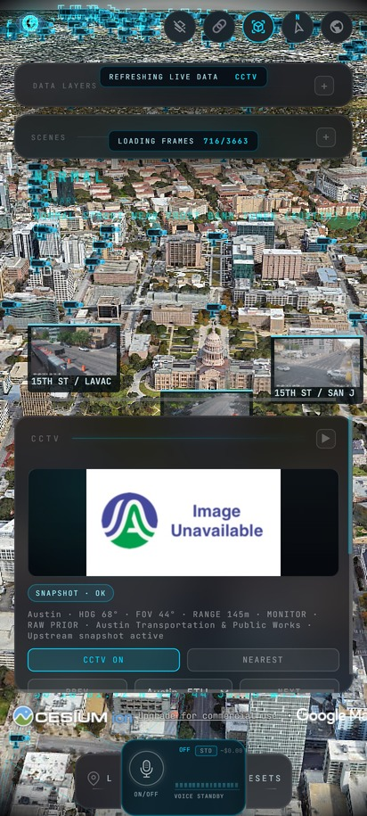
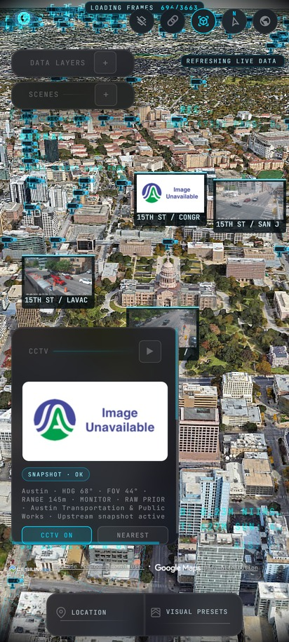
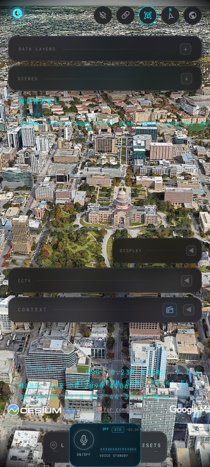
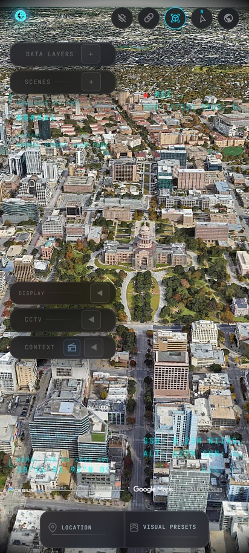
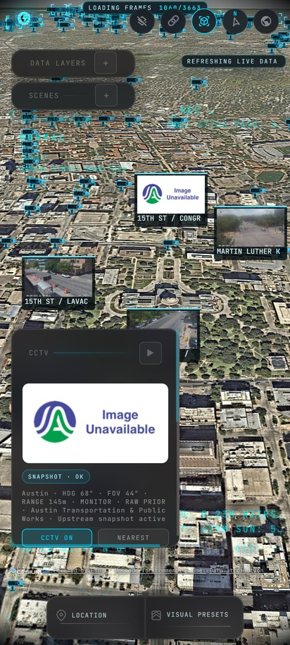
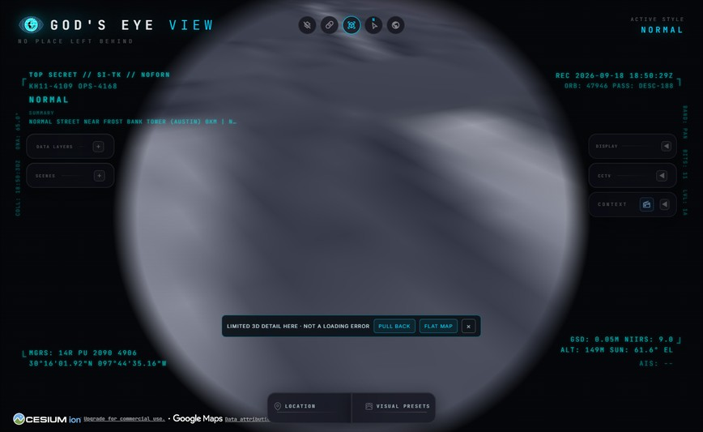

# 📱 God's Eye View: Mobile Patch Pack

Unofficial patch pack for [God's Eye View](https://github.com/bilawalsidhu/gods-eye-view), a real-time geospatial intelligence console: a photorealistic 3D globe with live aircraft, ships, satellites, fires, traffic, and CCTV cameras. This pack is not affiliated with, and not endorsed by, the upstream project or its author.

Upstream has no mobile layout yet. Its desktop UI (corner HUD readouts, side panels, a bottom dock) overlaps itself badly under about 640px of width. This pack adds two small files that fix that on a phone, plus an optional local launcher. It does not modify any file in the upstream app: everything here is additive.

## Before and after

Same app, same camera, on a 412px-wide phone screen (Galaxy S22 Ultra).

| Before | After |
| :---: | :---: |
|  |  |
| Status chips landing on the panel bars, attribution running off the right edge, dock reading "L" and "ESETS" | Bars compact and aligned, chip clear of the panels, map cameras visible, dock readable |

Idle, which is most of the time:

| Before | After |
| :---: | :---: |
|  |  |
| Five bars at 380px wide, 250px of stacked height | Five bars at 176px, 196px stacked, one straight column |

## What's in this pack

| File                      | Purpose                                                                                                                                                                         |
| ------------------------- | ------------------------------------------------------------------------------------------------------------------------------------------------------------------------------- |
| `mobile-fix.css`          | Phone layout fixes, scoped to `@media (max-width: 640px)`, plus one always-on rule that removes the voice control button (see [Voice control, removed](#voice-control-removed)) |
| `session-memory.js`       | Remembers which data layers were on and which map source was picked, and restores them on the next visit                                                                        |
| `mesh-detail.js`          | Explains the smeared 3D geometry when Google's mesh runs out of detail, and offers a one-tap fix                                                                                 |
| `start-gods-eye-view.cmd.example` | Optional Windows launcher that builds the app and opens it at an address you set                                                                                                |
| `LICENSE.upstream`        | A copy of the upstream project's license, kept here for attribution                                                                                                             |

## Install

**This pack is not the app.** It is three files that go into an existing
install of God's Eye View. If you do not have the app yet, start here:

```bash
git clone https://github.com/bilawalsidhu/gods-eye-view.git
cd gods-eye-view
npm ci
```

You need [Node.js](https://nodejs.org) (an LTS version) for that step.

**No accounts or API keys are required.** Upstream's own README says so
directly: the app starts with Esri satellite imagery and keyless terrain, with
OSM as a fallback. Keys are only needed for specific extras, and every one of
them has a free tier:

| Want | Needs |
| --- | --- |
| The app, a globe, flights, satellites, rocket launches | nothing at all |
| Google Photorealistic 3D Tiles (the 3D city view) | a free Cesium ion token |
| Live ships | a free AISStream key |
| Active fires | a free NASA FIRMS key (email only, no account) |
| Live road traffic | a free TomTom key |

Then install the pack:

1. Copy `mobile-fix.css`, `session-memory.js` and `mesh-detail.js` into the app's `public/` folder.
2. Add these three lines inside `<head>` in `index.html`:

   ```html
   <link rel="stylesheet" href="/mobile-fix.css" />
   <script src="/session-memory.js" defer></script>
   <script src="/mesh-detail.js" defer></script>
   ```

3. Build and run:

   ```bash
   npm run build
   npm run preview
   ```

Each file is independent, so you can install only the ones you want. To revert, delete the files and their lines; nothing else changes.

Because this pack never touches app source, it survives upstream updates on its own. The one exception is `index.html` itself: pulling an upstream update that replaces that file will overwrite your two added lines, so re-add them afterward.

## What changed on a phone

Measured in Chrome, emulating a Galaxy S22 Ultra (412x915 CSS pixels, device pixel ratio 3), with the Cameras layer on and 3,663 cameras loaded.

| Measurement                                     | Before                                                                          | After                                                               |
| ----------------------------------------------- | ------------------------------------------------------------------------------- | ------------------------------------------------------------------- |
| Side panel width (of a 412px-wide screen)       | 380px (92%)                                                                     | 176px (43%)                                                         |
| Five collapsed panel bars, combined height      | 250px                                                                           | 196px                                                               |
| HUD telemetry blocks overflowing the right edge | 6 blocks, up to 50px past the edge                                              | 0                                                                   |
| Bottom dock labels                              | Clipped to "L" and "ESETS" (the app's own phone rule caps them at 2.3rem, 37px) | Full text: "LOCATION" and "VISUAL PRESETS"                                 |
| Layer ON/OFF switch height                      | 20px                                                                            | 30px (trade-off: 7 layer rows fit on screen at once, instead of 10) |

Checked with automated browser tests: zero overlapping painted elements across three states (idle, DATA LAYERS panel open, CCTV in use). The layout at 1440x900 (desktop) is unaffected, since these rules are scoped to `max-width: 640px`.

### Voice control, removed

One rule in `mobile-fix.css` sits outside that media query on purpose: it hides the voice control button everywhere, on phone and desktop alike. That is a deliberate removal, not a layout fix: it is the only control in the app that can spend money on its own, and there is no other way to open a voice session. Delete that one rule to bring the button back; the voice feature's own code is untouched.

## Session memory

`session-memory.js` watches the app's own layer toggle switches and map source buttons (it clicks the real controls, it does not reach into app state) and saves the result to `localStorage` under the key `godsEyeView.local.setup.v1`.

- On every visit after the first, whichever layers were on and whichever map source was active come back automatically.
- On the very first visit, on a phone only, it opens on Esri Satellite instead of Google Photorealistic 3D, to save data. After that first visit, whatever source you pick is what you get from then on, including Google 3D. Desktop never takes this branch, so a desktop first visit keeps the app's normal default.
- Reset the saved setup at any time by running this in the browser console:

  ```js
  localStorage.removeItem("godsEyeView.local.setup.v1");
  ```

Opening cold into a saved setup, with Esri Satellite and the Cameras layer
already restored:



### Data caveat

Layer state is remembered, so closing the page with the Cameras layer on means the next visit starts pulling camera frames immediately, at about 34 MB per minute (see [Map data usage](#map-data-usage)). Turn Cameras off before closing the tab if you are on a metered connection.

## Why parts of the 3D view look melted

Google Photorealistic 3D Tiles are built from aerial photography and have a
finite resolution per area. Get closer than the data supports and the mesh
smears into unreadable blobs. It looks exactly like a loading failure, so it is
easy to assume something is broken or that an API quota ran out.

It usually isn't. Flying over downtown Austin with the view completely melted,
**1,199 requests to `tile.googleapis.com` all returned HTTP 200**. Nothing had
failed. The mesh simply had no more detail to give.

Measured at a fixed point, waiting for `tilesLoaded` at each height:

| Camera height | Triangles in view | Sharpness vs 1200m |
| ------------- | ----------------- | ------------------ |
| 1200 m        | 494,556           | 100%               |
| 500 m         | 548,748           | 104%               |
| 350 m         | 579,065           | 101%               |
| 250 m         | 357,271           | 70%                |
| 180 m         | 139,072           | 44%                |
| 120 m         | 24,985            | 10%                |

Detail is flat all the way down to about 350 m, then falls off a cliff.
Reflective glass towers and active construction sites are the worst cases,
because photogrammetry cannot resolve mirrored surfaces or moving cranes.



`mesh-detail.js` watches the triangle count in view (normalised per 1000 screen
pixels, so the same threshold works on a phone and a desktop) and when the mesh
has genuinely run out it shows a small dismissible chip offering two actions:

- **PULL BACK** rises to a height where detail returns, keeping the same ground
  point and orientation.
- **FLAT MAP** switches to Esri Satellite, which has no mesh to break.

It detects this from geometry rather than altitude because altitude alone would
need the ground elevation, which is not available here: `scene.globe.show` is
false, since the 3D tileset replaces the globe.

It never moves the camera on its own. Both actions are explicit taps, because
silently flying the camera would fight the CCTV projection and scene playback,
which move it deliberately.

There is no "still loading" indicator, on purpose. Every altitude sampled during
calibration reported `tilesLoaded` within one to two seconds, so an indicator
for that wait was noise, and on a phone it sat on top of the CCTV panel.

## Map data usage

Measured over about 30 seconds of panning, same route on both map sources:

| Source                         | Data used | Requests |
| ------------------------------ | --------- | -------- |
| Google Photorealistic 3D Tiles | 41.9 MB   | 293      |
| Esri Satellite                 | 1.7 MB    | 65       |

Other reference points:

- Cold load on Google 3D: about 62 MB.
- Idle for 90 seconds, untouched: 0 MB.
- Cameras layer on: about 33.7 MB per minute.

Cesium ion's free tier allows 15 GB per month of streaming, and 1,000 Google Photorealistic 3D Tiles root tile requests per month.

## Optional: Windows launcher

`start-gods-eye-view.cmd.example` is a convenience script for Windows. Copy it to `start-gods-eye-view.cmd` and set `GEV_HOST` at the top. It defaults to `localhost`, which only works on the machine running the server. To reach the app from a phone, set `GEV_HOST` to that machine's LAN address or its Tailscale address, and make sure `HOST` in your `.env` matches, otherwise the server will not be listening on the address you are opening. The script runs `npm run build`, then `npm run preview`. If the build fails, run `npm ci` in the project folder and try again.

## License

This patch pack is released under the MIT License, the same license as upstream.

`LICENSE.upstream` is a copy of the God's Eye View project's own license, kept here for attribution. Its source code is MIT too, but that file carries an extra note worth reading: some bundled datasets (a submarine cable map, flood event imagery) are under separate, NonCommercial licenses, and some live data providers require your own API credentials and restrict commercial use (see upstream's `DATA_SOURCES.md` for the full breakdown). This patch pack does not add, bundle, or touch any of that data; it only adds the files listed above.

All credit for the app itself goes to [bilawalsidhu/gods-eye-view](https://github.com/bilawalsidhu/gods-eye-view).
